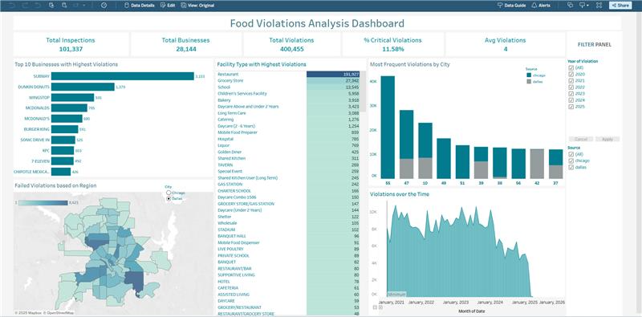
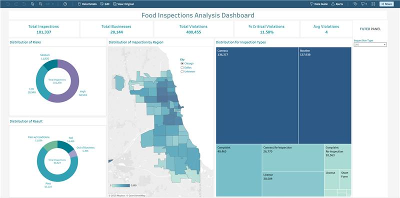

# 🍽️ Food Inspection Analysis

## 📌 Project Overview

This project presents a comprehensive food safety inspection analytics platform for restaurants and other food establishments in **Chicago** and **Dallas**, developed using publicly available government datasets. The objective is to empower public health officials, analysts, and decision-makers with actionable insights into:

- Inspection outcomes  
- Risk categories  
- Violation patterns  

By leveraging the **medallion architecture (bronze → silver → gold)** for data organization and analytics, the platform delivers clean, reliable, and structured data pipelines that drive impactful visualizations and decision support.

---

## 🛠️ Tools & Technologies

- **Azure Data Factory** – Orchestration for data cleaning  
- **Azure Data Lake** – Raw and curated data storage (bronze & silver layers)  
- **ER Studio** – Dimensional data modeling
- **Databricks** – Data Transformation and staging using PySpark notebooks  
- **Snowflake** – Data warehousing and analytical querying (gold layer)  
- **Tableau** – Dashboards for data visualization and insights  
- **Microsoft Excel** – Initial data exploration

---

## 🗂️ Datasets Overview

### **Chicago Food Inspections**
- Inspections of restaurants and other food establishments conducted by the **Chicago Department of Public Health’s Food Protection Program**
- Reviewed by licensed LEHPs (State of Illinois)
- [Link to Dataset](https://data.cityofchicago.org/Health-Human-Services/Food-Inspections/4ijn-s7e5/about_data)

### **Dallas Food Inspections**
- Conducted by the **Dallas Code Compliance Services Department**
- [Link to Dataset](https://www.dallasopendata.com/Services/Restaurant-and-Food-Establishment-Inspections-Octo/dri5-wcct/about_data)

---

## 🏗️ Architecture: Medallion Layers

- Raw Source Files (CSV) ↓ [Bronze Layer] → Ingested raw data (Azure Data Lake) ↓ [Silver Layer] → Cleaned,  deduplicated parquet files (Databricks) ↓ [Gold Layer] → Transformed facts and dimensions (Snowflake) 

---

## 🚀 How to Run the Pipeline

### 1. **Data Ingestion & Cleaning**
- Use **Azure Data Factory (ADF)** pipeline to:
  - Extract raw data from source containers
  - Clean and store as Parquet files in the **Silver Layer**

### 2. **Data Transformation**
- Open Databricks and run the following notebooks in order:

#### 🔹 `Chicago_Data_Transformation.ipynb`
- Reads Chicago Parquet from silver layer
- Applies transformations, standardization, flatten
- Writes to **stg_chicago table** in Snowflake

#### 🔹 `Dallas_Data_Transformation.ipynb`
- Similar processing for Dallas
- Outputs to **stg_dallas table** in Snowflake

#### 🔹 `Merge_Dallas_Chicago_Data.ipynb`
- Combines both staging tables
- Adds `source` column to identify origin
- Generates UUID-based `job_id` and date for `load_dt`
- Loads to the **final combined stage table** in Snowflake: `stg_final_table`

### 3. **Data Loading (Fact & Dim Model)**
- From the combined stage table, load into Snowflake **dimensions and facts**:
- Run the `Dynamic_Tables_Query.sql` to load data into dimensions and facts

---

## 📊 Tableau Dashboards
- [Dashboard Link](https://prod-useast-b.online.tableau.com/#/site/neudamg7370/workbooks/2666455/views)

- **Violation analysis dashboard**  

- **Inspection analysis dashboard**  

These dashboards help surface hotspots, compliance patterns, and risk zones to city officials.

---

## 🔍 Key Highlights

- Built with **modular, scalable architecture** using medallion pattern  
- All records tagged with `job_id`, `load_dt`, and `source` for auditability  

---

## 👥 Authors

- **Muskan Deepak Raisinghani** 
- **Rachana Keshav** 
- **Rishabh Shah** 

